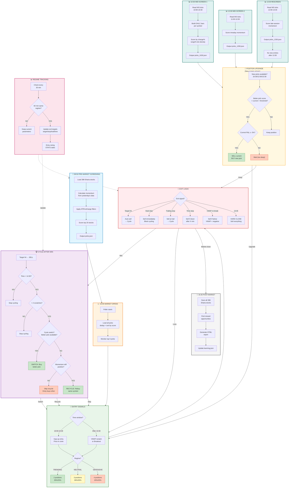

```mermaid
flowchart TD
    %% Subgraphs with clear grouping
    subgraph PREMARKET["🌅 09:50 PRE-MARKET SCREENING"]
        direction TB
        PM1["Load 398 Sharia stocks"] --> PM2["Calculate momentum<br/>from yesterday's data"]
        PM2 --> PM3["Apply ATR/vol/range filters"]
        PM3 --> PM4["Score top 20 stocks"]
        PM4 --> PM5["Output picks.json"]
    end

    subgraph MARKET_OPEN["📈 10:00 MARKET OPENS"]
        direction TB
        MO1["Poller starts"] --> MO2["Load all picks<br/>dedup + sort by score"]
        MO2 --> MO3["Monitor top 5 picks"]
    end

    subgraph ENTRY["🎯 ENTRY SIGNALS"]
        direction TB
        EN1{"Time window?"} -->|"10:00-10:30"| EN2["Gap-up entry<br/>Price in zone"]
        EN1 -->|"After 10:30"| EN3["VWAP reclaim<br/>or Breakout"]
        EN2 --> EN4{"Regime?"}
        EN3 --> EN4
        EN4 -->|"TRENDING"| EN5["2 positions<br/>35%/25%"]
        EN4 -->|"NEUTRAL"| EN6["3 positions<br/>30%/30%"]
        EN4 -->|"DEFENSIVE"| EN7["4 positions<br/>20%/20%"]
    end

    subgraph POSITION_UPGRADE["🔄 POSITION UPGRADE<br/>(New screen arrives)"]
        direction TB
        PU1["New picks available?<br/>10:30/12:00/13:30"] --> PU2{"Better pick score<br/>> current × threshold?"}
        PU2 -->|"YES"| PU3{"Current P&L ≥ -2%?"}
        PU2 -->|"NO"| PU4["Keep position"]
        PU3 -->|"YES"| PU5["SELL current<br/>BUY new pick"]
        PU3 -->|"NO"| PU6["Wait (too deep)"]
    end

    subgraph MIDSCREEN1["📊 10:30 MID-SCREEN 1"]
        direction TB
        MS1["Read WS ticks<br/>10:00-10:30"] --> MS2["Build OHLC bars<br/>per symbol"]
        MS2 --> MS3["Score by change%<br/>range% tick density"]
        MS3 --> MS4["Output picks_1030.json"]
    end

    subgraph MIDSCREEN2["📊 12:00 MID-SCREEN 2"]
        direction TB
        MS5["Read WS ticks<br/>11:00-12:00"] --> MS6["Score intraday momentum"]
        MS6 --> MS7["Output picks_1200.json"]
    end

    subgraph RESCREEN["📊 13:30 RESCREEN"]
        direction TB
        RS1["Read WS ticks<br/>12:00-13:30"] --> RS2["Score late-session<br/>momentum"]
        RS2 --> RS3["Output picks_1330.json"]
        RS3 --> RS4["No new entries<br/>after 13:30"]
    end

    subgraph CYCLE_WIN["🏆 CYCLE AFTER WIN"]
        direction TB
        CW1["Target hit → SELL"] --> CW2{"Time < 14:30?"}
        CW2 -->|"NO"| CW3["Stop cycling"]
        CW2 -->|"YES"| CW4{"< 2 scratches?"}
        CW4 -->|"NO"| CW5["Stop cycling"]
        CW4 -->|"YES"| CW6{"Cycle switch?<br/>Better pick available?"}
        CW6 -->|"YES"| CW7["SWITCH: Buy<br/>better pick"]
        CW6 -->|"NO"| CW8{"Momentum still<br/>positive?"}
        CW8 -->|"NO"| CW9["Skip recycle<br/>Entry buys other"]
        CW8 -->|"YES"| CW10["RECYCLE: Rebuy<br/>same symbol"]
    end

    subgraph EXIT["🛑 EXIT LOGIC"]
        direction TB
        EX1{"Exit signal?"} -->|"Target hit"| EX2["Auto-sell<br/>→ Cycle"]
        EX1 -->|"Hard stop"| EX3["Sell immediately<br/>Block cycling"]
        EX1 -->|"Trailing stop"| EX4["Sell at trail<br/>→ Cycle"]
        EX1 -->|"Time stop"| EX5["Sell if down<br/>after X min"]
        EX1 -->|"VWAP re-break"| EX6["Sell if below<br/>VWAP + negative"]
        EX1 -->|"14:45"| EX7["HARD CLOSE<br/>Sell everything"]
    end

    subgraph REGIME["📊 REGIME TRACKING"]
        direction TB
        RG1["Check every<br/>30 min"] --> RG2{"60 min same<br/>regime?"}
        RG2 -->|"NO"| RG3["Keep current<br/>parameters"]
        RG2 -->|"YES"| RG4["Update exit targets<br/>target/stop/trail/time"]
        RG4 --> RG5["Entry sizing<br/>STAYS static"]
    end

    subgraph POST_MARKET["🌙 15:35 POST-MARKET"]
        direction TB
        PM21["Scan all 398<br/>Sharia stocks"] --> PM22["Find missed<br/>opportunities"]
        PM22 --> PM23["Generate HTML<br/>report"]
        PM23 --> PM24["Update learning.json"]
    end

    %% Main flow connections
    PREMARKET --> MARKET_OPEN
    MARKET_OPEN --> ENTRY
    ENTRY --> EXIT
    
    EXIT -->|"Win"| CYCLE_WIN
    EXIT -->|"Loss"| ENTRY
    
    MIDSCREEN1 --> POSITION_UPGRADE
    MIDSCREEN2 --> POSITION_UPGRADE
    RESCREEN --> POSITION_UPGRADE
    
    POSITION_UPGRADE -->|"Upgrade"| ENTRY
    POSITION_UPGRADE -->|"Keep"| EXIT
    
    CYCLE_WIN -->|"Switch"| ENTRY
    CYCLE_WIN -->|"Recycle"| ENTRY
    CYCLE_WIN -->|"Skip"| ENTRY
    
    REGIME -.->|"Update"| EXIT
    REGIME -.->|"Update"| CYCLE_WIN
    
    EXIT -->|"Market close"| POST_MARKET
    
    %% Style
    style PREMARKET fill:#e1f5fe,stroke:#0277bd,stroke-width:2px
    style MARKET_OPEN fill:#fff3e0,stroke:#ef6c00,stroke-width:2px
    style ENTRY fill:#e8f5e9,stroke:#2e7d32,stroke-width:2px
    style EXIT fill:#ffebee,stroke:#c62828,stroke-width:2px
    style CYCLE_WIN fill:#f3e5f5,stroke:#7b1fa2,stroke-width:2px
    style POSITION_UPGRADE fill:#fff8e1,stroke:#f9a825,stroke-width:2px
    style MIDSCREEN1 fill:#e0f2f1,stroke:#00695c,stroke-width:2px
    style MIDSCREEN2 fill:#e0f2f1,stroke:#00695c,stroke-width:2px
    style RESCREEN fill:#e0f2f1,stroke:#00695c,stroke-width:2px
    style REGIME fill:#fce4ec,stroke:#c2185b,stroke-width:2px
    style POST_MARKET fill:#f5f5f5,stroke:#424242,stroke-width:2px
    
    style EN5 fill:#c8e6c9,stroke:#388e3c
    style EN6 fill:#fff9c4,stroke:#f57f17
    style EN7 fill:#ffccbc,stroke:#d84315
    style CW7 fill:#c8e6c9,stroke:#388e3c
    style CW10 fill:#c8e6c9,stroke:#388e3c
    style CW9 fill:#ffccbc,stroke:#d84315
    style PU5 fill:#c8e6c9,stroke:#388e3c
    style PU6 fill:#ffccbc,stroke:#d84315
```